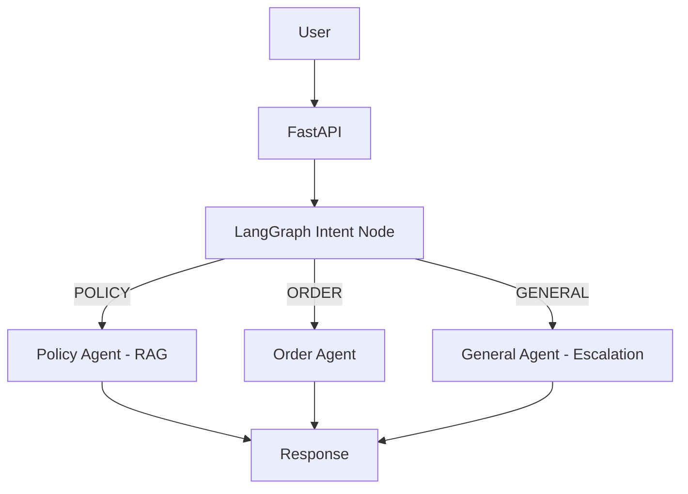

## 🚀 Support Nexus – Backend

      The backend leverages LangGraph to orchestrate a stateful, 
      graph-driven multi-agent workflow for intelligent customer support automation.

Support Nexus Backend is built using FastAPI and LangGraph to handle intelligent query routing, multi-agent coordination, and retrieval-augmented generation (RAG).

## 🧠 System Overview

      This backend implements a modular, graph-based AI architecture that enables:

      1.Intent detection and query classification

      2.Dynamic agent routing

      3.Context-aware response generation

      4.PDF ingestion into a vector database

      5.Asynchronous background processing

Unlike traditional request-response APIs, this system uses a stateful execution graph to manage control flow and agent coordination.

## 🏗️ System Architecture

## 🔁 Execution Pipeline

      1.Request received via FastAPI endpoint

      2.Initial state object created

      3.LangGraph execution begins

      4.Intent node classifies query

      5.Router selects appropriate agent

      6.Retrieval node fetches context (if required)

      7.Agent generates response

      8.Final structured state returned
      
## 📂 Project Structure

      backend/
      │
      ├── Api_endpoint/         # FastAPI route definitions
      ├── agents/               # Policy, Order, General agents
      ├── core/                 # Core orchestration logic
      ├── graph/                # LangGraph graph builder & execution
      ├── Nodes/                # Graph node implementations
      ├── state/                # Shared state definitions
      ├── ingestion/            # PDF ingestion pipeline
      ├── vector_database/      # Embedding storage & retrieval
      ├── Database_utility/     # DB helper utilities
      ├── Data/                 # Supporting data
      ├── schema/               # Pydantic request/response models
      ├── uploads/              # Uploaded PDF storage
      │
      ├── main.py               # FastAPI entry point
      ├── Dockerfile
      ├── requirements.txt
      └── README.md

## 🤖 Multi-Agent Design

**Agent Responsibility**

      Policy Agent --->	Handles policy-related queries
      Order Agent	---> Handles order-specific queries
      General Agent	---> Handles fallback/general queries

      LangGraph enables conditional routing between agents based on classified intent.

      This modular design allows easy extension with new agents.

## 📄 Document Ingestion Pipeline (RAG)

**Upload Flow:**

      1.File uploaded via /upload

      2.Saved to uploads/

      3.Background task triggered

      4.PDF parsed and chunked

      5.Embeddings generated

      6.Stored in vector database

      7.Retrieval node accesses embeddings during query execution

This enables context-aware answer generation.

## 🔌 API Endpoints

      **📌 Query Endpoint**

      POST /api/v1/query

      Request
      {
        "question": "What is refund policy?",
        "user_id": "Amit_123"
      }

      Response
      {
        "status": "success",
        "messages": {
        "question": "...",
        "intent": "POLICY",
        "answer": "...",
        "user_id": "...",
        "order_id_required": false
        }
      }

     ** 📌 Upload Endpoint**

      POST /api/v1/upload/upload

      1.Content-Type: multipart/form-data

      2.Field name: file

      3.Only PDF allowed

      4.Triggers asynchronous ingestion

## 🛠️ Tech Stack

      FastAPI
      Langchain
      LangGraph
      Python
      Pydantic
      BackgroundTasks
      Vector Database
      Docker
      Postgresql

## ▶️ Run Locally

**1️⃣ Install Dependencies**

      pip install -r requirements.txt

**2️⃣ Start Server**

      uvicorn main:app --reload

**Backend runs at:**

      http://127.0.0.1:8000

**Swagger Documentation:**

      http://127.0.0.1:8000/docs

## 🐳 Docker Support

**Build**

      docker build -t support-nexus-backend .

**Run**

      docker run -p 8000:8000 support-nexus-backend

## 🔗 Related Repository

**Frontend Interface:**

      👉 https://github.com/Amit-9889/support-nexus-frontend/
